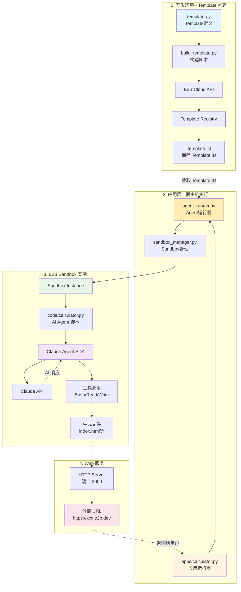
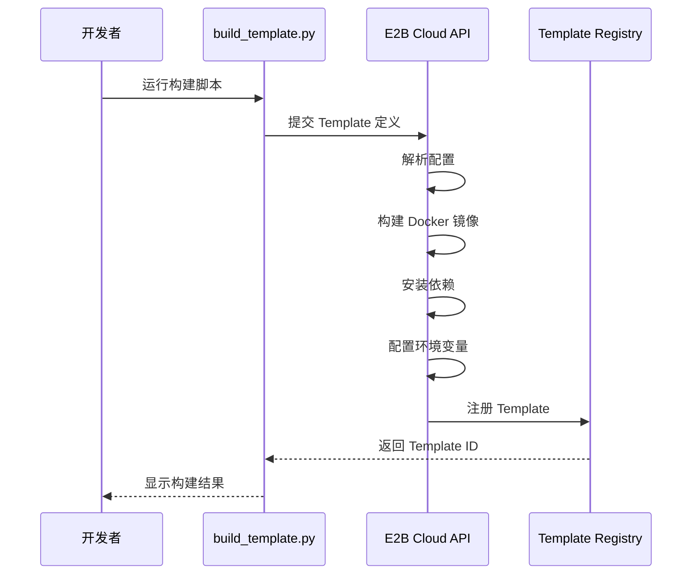
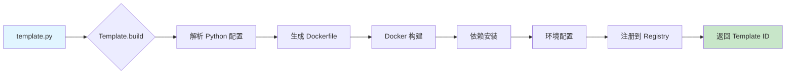
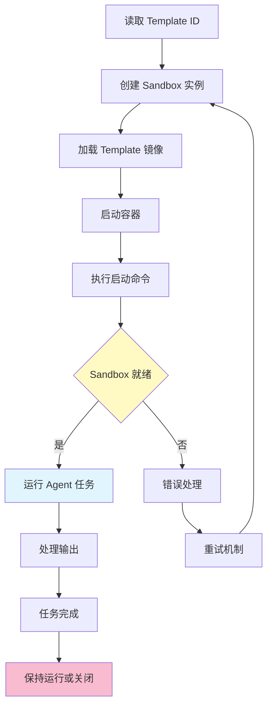
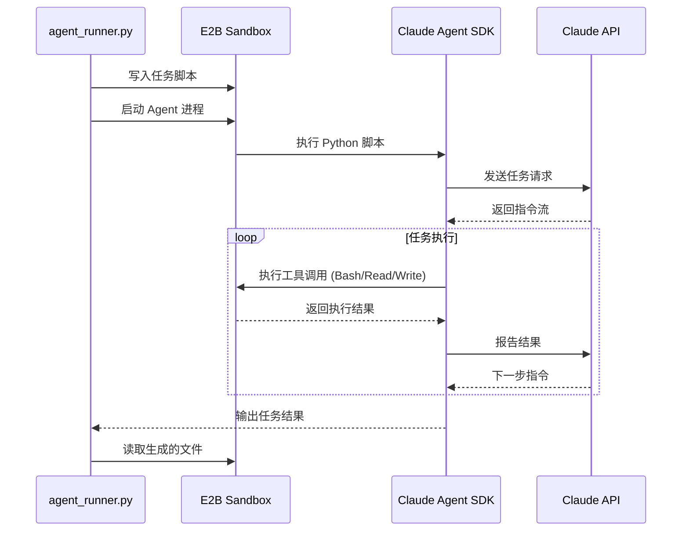

# E2B Template + Claude Agent SDK 系统架构设计

## 概述

本文档描述了如何使用 E2B Template Python API 替代 Dockerfile，并在 E2B Sandbox 中运行 Claude Agent SDK 的完整技术架构。

## 1. 整体架构

### 1.1 项目结构

```
e2b_project/
├── src/
│   ├── template.py              # E2B Template 定义
│   ├── build_template.py        # Template 构建脚本
│   ├── sandbox_manager.py       # Sandbox 生命周期管理
│   ├── agent_runner.py          # Agent 运行器（核心）
│   ├── code/                    # AI Agent 脚本（在 Sandbox 内执行）
│   │   ├── calculator.py        # 计算器应用生成器
│   │   └── memo.py              # 备忘录应用生成器
│   └── apps/                    # 应用运行器（在宿主机执行）
│       ├── __init__.py
│       └── calculator.py        # 计算器应用运行器
├── docs/                        # 项目文档
├── tests/                       # 测试文件
├── .env                         # 环境变量配置
├── .template_id                 # Template ID（构建后生成）
└── e2b_claude_agent_sdk.ipynb  # Jupyter 示例
```

### 1.2 架构图



### 1.3 技术栈

| 层级 | 技术组件 | 作用 |
|-----|---------|-----|
| **开发层** | Python 3.8+ | 核心开发语言 |
| | E2B SDK | Template 构建和 Sandbox 管理 |
| | python-dotenv | 环境变量管理 |
| **基础设施层** | E2B Cloud | Sandbox 容器运行环境 |
| | Docker | 底层容器技术 |
| **运行时层** | Ubuntu 22.04 | 基础操作系统 |
| | Node.js | Claude Code CLI 运行环境 |
| | Python 3.10+ | Claude Agent SDK 运行环境 |
| **应用层** | Claude Code CLI | AI 编程助手命令行工具 |
| | Claude Agent SDK | AI Agent 开发框架 |

## 2. 核心组件设计

### 2.1 Template 定义层

**职责**: 使用 Python 代码定义 Sandbox 环境配置

**核心文件**: `template.py`

```python
import os
from dotenv import load_dotenv
from e2b import Template, wait_for_timeout

# 加载 .env 文件
load_dotenv()

# 使用链式 API 定义 Template
template = (
    Template()
    .from_base_image()  # 使用默认镜像
    .set_user("user")  # 设置用户
    .set_workdir("/home/user/workspace")  # 工作目录
    .run_cmd("npm install -g @anthropic-ai/claude-code")
    .run_cmd("pip install claude-agent-sdk")
    .run_cmd("pip install anthropic")
    .set_envs({
        "ANTHROPIC_AUTH_TOKEN": os.getenv("ANTHROPIC_AUTH_TOKEN", ""),
        "ANTHROPIC_BASE_URL": os.getenv("ANTHROPIC_BASE_URL", "https://open.bigmodel.cn/api/anthropic"),
        "ANTHROPIC_DEFAULT_OPUS_MODEL": os.getenv("ANTHROPIC_DEFAULT_OPUS_MODEL", "GLM-4.6"),
        "ANTHROPIC_DEFAULT_SONNET_MODEL": os.getenv("ANTHROPIC_DEFAULT_SONNET_MODEL", "GLM-4.6"),
        "ANTHROPIC_DEFAULT_HAIKU_MODEL": os.getenv("ANTHROPIC_DEFAULT_HAIKU_MODEL", "GLM-4.5-Air"),
        "WORKSPACE_DIR": "/home/user/workspace"
    })
    .set_start_cmd(
        """echo "=== Version Check ===" && python --version && pip --version && node --version && npm --version && claude-code --version""",
        wait_for_timeout(5_000)
    )
)
```

**优势对比**:

| 特性 | Dockerfile | Template API |
|-----|-----------|-------------|
| 版本控制 | 需要额外 CI 配置 | 原生 Python，Git 友好 |
| 动态配置 | 需要构建参数 | 直接读取环境变量 |
| 类型安全 | 无 | Python 类型提示 |
| 调试 | 需要 Docker 命令 | Python 异常栈 |
| IDE 支持 | 有限 | 完整自动补全 |

### 2.2 Template 构建层

**职责**: 将 Template 定义构建为可用的 Sandbox 模板

**核心文件**: `build_template.py`

```python
from e2b import Template, default_build_logger
from template import template

# 构建并注册 Template
result = Template.build(
    template,
    alias="claude-agent-sandbox",  # 友好的别名
    cpu_count=2,                    # CPU 资源
    memory_mb=2048,                 # 内存资源
    on_build_logs=default_build_logger()  # 实时日志
)

print(f"Template ID: {result.template_id}")
```

**构建流程**:



### 2.3 Sandbox 管理层

**职责**: 管理 Sandbox 生命周期，提供长期运行服务支持

**核心文件**: `sandbox_manager.py`

**关键特性**:
- ✅ 自动创建和销毁
- ✅ 错误恢复和重试
- ✅ 资源监控
- ✅ Context Manager 模式

```python
from e2b import AsyncSandbox

class SandboxManager:
    """长期运行的 Sandbox 管理器"""

    async def __aenter__(self):
        self.sandbox = await AsyncSandbox.create(self.template_id)
        return self.sandbox

    async def __aexit__(self, exc_type, exc_val, exc_tb):
        if self.sandbox:
            await self.sandbox.close()
```

### 2.4 Agent 集成层

**职责**: 在 Sandbox 内运行 Claude Agent SDK，处理 AI 任务

**核心文件**: `agent_runner.py`

**运行模式**: 支持两种模式

1. **自动清理模式** - `run_code_in_sandbox()`: 执行完自动关闭Sandbox
2. **服务模式** - `run_code_with_service()`: 保持Sandbox运行,获取服务URL

```python
async def run_code_in_sandbox(code_file: str, env_vars: Optional[dict] = None) -> dict:
    """在 E2B Sandbox 中运行 code/*.py 脚本（自动清理）"""

    # 1. 读取 Template ID
    template_id = _read_template_id()

    # 2. 读取代码文件
    code_content = Path(f"code/{code_file}").read_text()

    # 3. 创建 Sandbox 并执行
    async with SandboxManager(template_id, env_vars) as manager:
        # 上传代码文件
        await manager.sandbox.files.write(f"/home/user/workspace/{code_file}", code_content)

        # 执行代码
        result = await manager.sandbox.commands.run(f"python /home/user/workspace/{code_file}")

        # 列出生成的文件
        files = await manager.sandbox.files.list("/home/user/workspace")

    return {"exit_code": result.exit_code, "files": [f.name for f in files]}


async def run_code_with_service(code_file: str, service_port: int, ...) -> dict:
    """在 E2B Sandbox 中运行代码并获取服务 URL（保持运行）"""

    # 创建 Sandbox（不使用 Context Manager）
    manager = SandboxManager(template_id, env_vars)
    await manager.start()

    # 执行代码
    result = await manager.sandbox.commands.run(...)

    # 获取服务 URL
    service_url = f"https://{manager.sandbox.get_host(port=service_port)}"

    # 不关闭 Sandbox，保持服务运行
    return {"exit_code": result.exit_code, "service_url": service_url, "sandbox_id": manager.sandbox.sandbox_id}
```

**应用运行器层**: `apps/calculator.py`

```python
async def main():
    """运行计算器应用生成器"""
    # 调用 agent_runner 执行 code/calculator.py
    result = await run_code_with_service(
        code_file="calculator.py",
        service_port=3000
    )

    print(f"✅ 服务 URL: {result['service_url']}")
```

## 3. 数据流程

### 3.1 Template 构建流程



### 3.2 Sandbox 运行流程



### 3.3 Agent 任务执行流程



## 4. Dockerfile vs Template API 对比

### 4.1 功能映射

| Dockerfile 指令 | Template API 方法 | 示例 |
|----------------|------------------|------|
| `FROM` | `.from_base_image()` | `.from_base_image()` |
| `RUN` | `.run_commands()` | `.run_commands(["apt-get update"])` |
| `ENV` | `.set_envs()` | `.set_envs({"KEY": "value"})` |
| `WORKDIR` | `.set_workdir()` | `.set_workdir("/app")` |
| `COPY` | `.copy_files()` | `.copy_files("./src", "/app/src")` |
| `CMD` | `.set_start_cmd()` | `.set_start_cmd("python app.py")` |

### 4.2 完整转换示例

**原 Dockerfile**:
```dockerfile
FROM e2bdev/code-interpreter:latest

# 安装 Claude Code CLI
RUN npm install -g @anthropic-ai/claude-code

# 安装 Claude Agent SDK
RUN pip install claude-agent-sdk

# 设置环境变量
ENV ANTHROPIC_BASE_URL=https://open.bigmodel.cn/api/anthropic
ENV ANTHROPIC_AUTH_TOKEN=ae797277aa7543afb311fbb9fc45d53b.rulbucDTC4G5b4Gd
ENV ANTHROPIC_DEFAULT_OPUS_MODEL="GLM-4.6"
ENV ANTHROPIC_DEFAULT_SONNET_MODEL="GLM-4.6"
ENV ANTHROPIC_DEFAULT_HAIKU_MODEL="GLM-4.5-Air"
```

**转换后的 template.py**:
```python
import os
from dotenv import load_dotenv
from e2b import Template, wait_for_timeout

# 加载 .env 文件
load_dotenv()

template = (
    Template()
    # FROM 指令
    .from_base_image()  # 使用默认镜像

    # USER 指令（设置用户）
    .set_user("user")

    # WORKDIR 指令（工作目录）
    .set_workdir("/home/user/workspace")

    # RUN 指令（安装依赖）
    .run_cmd("npm install -g @anthropic-ai/claude-code")
    .run_cmd("pip install claude-agent-sdk")
    .run_cmd("pip install anthropic")

    # ENV 指令（环境变量 - 从 .env 动态加载）
    .set_envs({
        "ANTHROPIC_AUTH_TOKEN": os.getenv("ANTHROPIC_AUTH_TOKEN", ""),
        "ANTHROPIC_BASE_URL": os.getenv("ANTHROPIC_BASE_URL", "https://open.bigmodel.cn/api/anthropic"),
        "ANTHROPIC_DEFAULT_OPUS_MODEL": os.getenv("ANTHROPIC_DEFAULT_OPUS_MODEL", "GLM-4.6"),
        "ANTHROPIC_DEFAULT_SONNET_MODEL": os.getenv("ANTHROPIC_DEFAULT_SONNET_MODEL", "GLM-4.6"),
        "ANTHROPIC_DEFAULT_HAIKU_MODEL": os.getenv("ANTHROPIC_DEFAULT_HAIKU_MODEL", "GLM-4.5-Air"),
        "WORKSPACE_DIR": "/home/user/workspace"
    })

    # CMD 指令（启动命令 - 版本检查）
    .set_start_cmd(
        """echo "=== Version Check ===" && python --version && pip --version && node --version && npm --version && claude-code --version""",
        wait_for_timeout(5_000)
    )
)
```

### 4.3 优势总结

**Template API 优势**:

1. **类型安全**: Python 类型提示提供编译时检查
2. **动态配置**: 可以读取环境变量、配置文件
3. **版本控制**: 原生 Python，无需额外工具
4. **调试友好**: Python 异常栈清晰
5. **IDE 支持**: 完整的自动补全和文档
6. **可测试**: 可以编写单元测试验证配置

**使用建议**:

- ✅ **推荐使用 Template API**: 新项目、需要动态配置、团队熟悉 Python
- ⚠️ **继续使用 Dockerfile**: 已有 Docker 工作流、需要兼容其他工具

## 5. 安全性设计

### 5.1 敏感信息管理

```python
# ❌ 错误：硬编码敏感信息
template = Template().set_envs({
    "API_KEY": "sk-1234567890abcdef"  # 不安全！
})

# ✅ 正确：从环境变量读取
import os

template = Template().set_envs({
    "API_KEY": os.getenv("API_KEY", "")  # 安全
})
```

### 5.2 资源限制

```python
# 在构建时设置资源限制
result = Template.build(
    template,
    cpu_count=2,        # 限制 CPU
    memory_mb=2048,     # 限制内存（2GB）
)

# 在运行时监控资源使用
sandbox = await AsyncSandbox.create(
    template=template_id,
    timeout=3600  # 1小时超时
)
```

### 5.3 网络隔离

E2B Sandbox 提供：
- ✅ 网络隔离（默认无法访问外部网络，除非明确配置）
- ✅ 文件系统隔离（每个 Sandbox 独立）
- ✅ 进程隔离（容器级别隔离）

## 6. 性能考虑

### 6.1 Template 构建优化

```python
# ❌ 低效：每个命令单独执行
template = Template().run_commands([
    "apt-get update",
    "apt-get install -y curl",
    "apt-get install -y git"
])

# ✅ 高效：批量执行
template = Template().run_commands([
    "apt-get update && apt-get install -y curl git"
])
```

### 6.2 Sandbox 复用

```python
# 长期运行模式：复用同一个 Sandbox
async with SandboxManager(template_id) as sandbox:
    # 执行多个任务
    await sandbox.run_code("python", "task1.py")
    await sandbox.run_code("python", "task2.py")
    await sandbox.run_code("python", "task3.py")
    # 自动清理
```

### 6.3 并行处理

```python
# 并行创建多个 Sandbox 处理任务
import asyncio

async def process_tasks(tasks, template_id):
    async def run_task(task):
        async with SandboxManager(template_id) as sandbox:
            return await sandbox.run_code("python", task)

    results = await asyncio.gather(*[run_task(t) for t in tasks])
    return results
```

## 7. 总结

本架构设计通过 E2B Template Python API 完全替代了 Dockerfile，提供了：

1. **更好的开发体验**: Python 类型安全、IDE 支持
2. **更灵活的配置**: 动态读取环境变量、配置文件
3. **更强的可维护性**: 代码即配置，Git 版本控制
4. **长期运行支持**: Sandbox 管理器模式，适合持续服务
5. **完整的 Agent 集成**: 在隔离环境中安全运行 Claude Agent SDK

下一章节将详细介绍 Template API 的使用方法和最佳实践。
