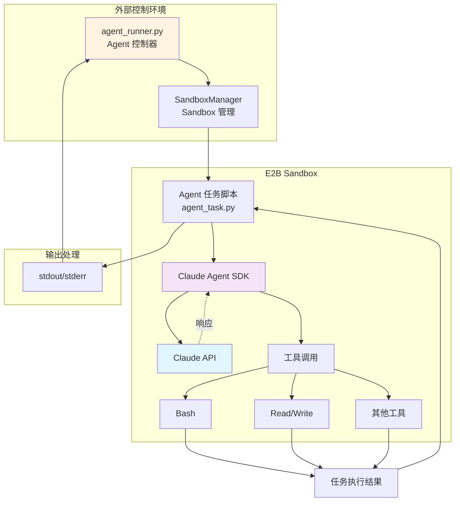
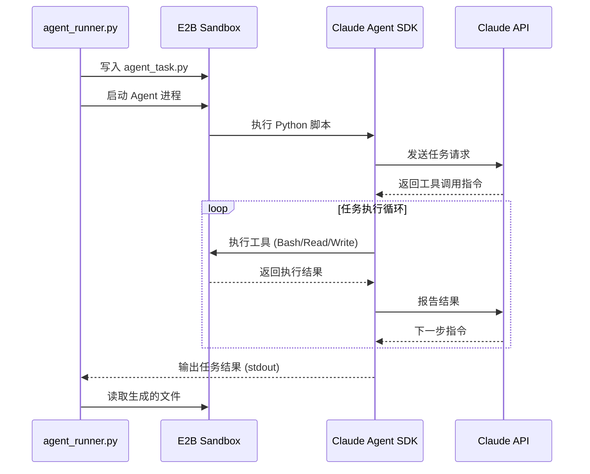

# Claude Agent SDK 集成指南

## 概述

本文档详细介绍如何在 E2B Sandbox 中集成和运行 Claude Agent SDK，实现 AI Agent 在隔离环境中安全执行任务。

## 1. 集成架构

### 1.1 架构概览



### 1.2 数据流程



## 2. 基础集成

### 2.1 简单 Agent 任务执行

```python
"""
agent_runner.py - 在 Sandbox 中运行 Claude Agent SDK
"""

import asyncio
import os
from e2b import AsyncSandbox
from dotenv import load_dotenv

load_dotenv()


async def run_simple_agent_task():
    """运行简单的 Agent 任务"""

    # Agent 任务脚本
    agent_script = """
import asyncio
from claude_agent_sdk import ClaudeSDKClient, ClaudeAgentOptions

async def main():
    # 配置 Agent 选项
    options = ClaudeAgentOptions(
        allowed_tools=["Bash", "Read", "Write"],
        permission_mode="bypassPermissions"
    )

    # 创建 Agent 客户端
    async with ClaudeSDKClient(options) as client:
        # 发送任务
        await client.query("Create a hello.py file that prints 'Hello from E2B Sandbox'")

        # 接收响应
        async for message in client.receive_response():
            print(message)

if __name__ == "__main__":
    asyncio.run(main())
"""

    # 创建 Sandbox
    sandbox = await AsyncSandbox.create(
        template="claude-agent-sandbox",
        env_vars={
            "ANTHROPIC_AUTH_TOKEN": os.getenv("ANTHROPIC_AUTH_TOKEN")
        }
    )

    try:
        print("✅ Sandbox 已创建")

        # 写入 Agent 脚本
        await sandbox.files.write("/home/user/workspace/agent_task.py", agent_script)
        print("✅ Agent 脚本已写入")

        # 执行 Agent 任务
        print("🚀 开始执行 Agent 任务...")
        result = await sandbox.run_code(
            "python",
            "exec(open('/home/user/workspace/agent_task.py').read())",
            on_stdout=lambda msg: print(f"[Agent] {msg}"),
            on_stderr=lambda msg: print(f"[Error] {msg}")
        )

        print(f"\n✅ 任务完成 (退出码: {result.exit_code})")

        # 检查生成的文件
        if await sandbox.files.exists("/home/user/workspace/hello.py"):
            content = await sandbox.files.read("/home/user/workspace/hello.py")
            print(f"\n📄 生成的文件内容:\n{content}")

    finally:
        await sandbox.close()
        print("✅ Sandbox 已关闭")


if __name__ == "__main__":
    asyncio.run(run_simple_agent_task())
```

### 2.2 使用进程模式运行（推荐）

```python
async def run_agent_as_process():
    """使用进程模式运行 Agent（长期运行）"""

    agent_script = """
import asyncio
from claude_agent_sdk import ClaudeSDKClient, ClaudeAgentOptions

async def main():
    options = ClaudeAgentOptions(
        allowed_tools=["Bash", "Read", "Write", "Glob", "Grep"],
        permission_mode="bypassPermissions"
    )

    async with ClaudeSDKClient(options) as client:
        # 更复杂的任务
        await client.query('''
Create a simple Python web application:
1. Create app.py with a Flask server
2. Create requirements.txt
3. Create a README.md with instructions
''')

        async for message in client.receive_response():
            print(message)

asyncio.run(main())
"""

    sandbox = await AsyncSandbox.create(
        template="claude-agent-sandbox",
        env_vars={
            "ANTHROPIC_AUTH_TOKEN": os.getenv("ANTHROPIC_AUTH_TOKEN")
        },
        timeout=3600  # 1 小时超时
    )

    try:
        # 写入脚本
        await sandbox.files.write("/home/user/workspace/agent_task.py", agent_script)

        # 启动为长期运行进程
        process = await sandbox.start_process(
            cmd="python /home/user/workspace/agent_task.py",
            on_stdout=lambda msg: print(f"[Agent] {msg}"),
            on_stderr=lambda msg: print(f"[Error] {msg}"),
            on_exit=lambda code: print(f"[Exit] 进程退出，代码: {code}")
        )

        print(f"✅ Agent 进程已启动 (PID: {process.pid})")

        # 等待进程完成
        exit_code = await process.wait()
        print(f"\n✅ Agent 任务完成 (退出码: {exit_code})")

        # 列出生成的文件
        files = await sandbox.files.list("/home/user/workspace")
        print("\n📂 生成的文件:")
        for file_info in files:
            if file_info.name.endswith(('.py', '.txt', '.md')):
                print(f"  - {file_info.name}")

    finally:
        await sandbox.close()


if __name__ == "__main__":
    asyncio.run(run_agent_as_process())
```

## 3. Agent 运行器实现

### 3.1 实际项目中的 Agent 运行器

实际项目中的 `agent_runner.py` 提供两个核心函数，分别用于不同场景：

**核心函数：**

1. **`run_code_in_sandbox(code_file, env_vars)`** - 自动清理模式
   - 执行完成后自动关闭 Sandbox
   - 适用于一次性任务
   - 返回退出码和生成文件列表

2. **`run_code_with_service(code_file, service_port, env_vars, wait_time)`** - 服务模式
   - 执行后保持 Sandbox 运行
   - 获取服务外部访问 URL
   - 适用于 Web 服务

```python
"""
agent_runner.py - 在 E2B Sandbox 中运行 code/*.py 脚本

该模块提供核心功能，用于在 E2B Sandbox 中执行 AI 代码生成脚本。
保持 Sandbox 环境清洁，只包含 AI 生成的代码文件。
"""

import asyncio
import os
from typing import Optional, Dict, List
from dataclasses import dataclass
from e2b import AsyncSandbox
from dotenv import load_dotenv

load_dotenv()


@dataclass
class AgentTask:
    """Agent 任务定义"""
    query: str
    allowed_tools: List[str]
    workspace: str = "/home/user/workspace"
    timeout: int = 3600


@dataclass
class AgentResult:
    """Agent 执行结果"""
    exit_code: int
    stdout: str
    stderr: str
    generated_files: List[str]
    success: bool


class AgentRunner:
    """
    Claude Agent SDK 运行器

    管理 Agent 在 E2B Sandbox 中的执行
    """

    def __init__(
        self,
        template_id: str = "claude-agent-sandbox",
        env_vars: Optional[Dict[str, str]] = None
    ):
        self.template_id = template_id
        self.env_vars = env_vars or {}
        self.sandbox: Optional[AsyncSandbox] = None

        # 输出缓冲
        self._stdout_buffer = []
        self._stderr_buffer = []

    async def __aenter__(self):
        """Context manager 进入"""
        await self.start()
        return self

    async def __aexit__(self, exc_type, exc_val, exc_tb):
        """Context manager 退出"""
        await self.close()

    async def start(self):
        """启动 Sandbox"""
        if self.sandbox is not None:
            return

        print(f"🚀 正在启动 Agent 运行器...")

        # 合并默认环境变量
        default_env = {
            "ANTHROPIC_AUTH_TOKEN": os.getenv("ANTHROPIC_AUTH_TOKEN", ""),
        }
        env_vars = {**default_env, **self.env_vars}

        self.sandbox = await AsyncSandbox.create(
            template=self.template_id,
            env_vars=env_vars,
            timeout=7200  # 2 小时
        )

        print(f"✅ Sandbox 已创建 (ID: {self.sandbox.id})")

    async def close(self):
        """关闭 Sandbox"""
        if self.sandbox is None:
            return

        print(f"🔄 正在关闭 Sandbox...")
        await self.sandbox.close()
        self.sandbox = None
        print("✅ Sandbox 已关闭")

    def _generate_agent_script(self, task: AgentTask) -> str:
        """生成 Agent 任务脚本"""

        tools_str = ', '.join(f'"{tool}"' for tool in task.allowed_tools)

        script = f"""
import asyncio
import sys
from claude_agent_sdk import ClaudeSDKClient, ClaudeAgentOptions

async def main():
    try:
        # 配置 Agent 选项
        options = ClaudeAgentOptions(
            allowed_tools=[{tools_str}],
            permission_mode="bypassPermissions",
            cwd="{task.workspace}"
        )

        # 创建客户端
        async with ClaudeSDKClient(options) as client:
            print("✅ Agent 客户端已初始化", flush=True)

            # 发送任务
            await client.query('''{task.query}''')

            # 接收响应
            async for message in client.receive_response():
                print(message, flush=True)

            print("✅ 任务执行完成", flush=True)

    except Exception as e:
        print(f"❌ Agent 执行出错: {{e}}", file=sys.stderr, flush=True)
        sys.exit(1)

if __name__ == "__main__":
    asyncio.run(main())
"""
        return script

    async def run_task(self, task: AgentTask) -> AgentResult:
        """
        运行 Agent 任务

        Args:
            task: Agent 任务定义

        Returns:
            AgentResult: 执行结果
        """
        if self.sandbox is None:
            raise RuntimeError("Sandbox 未启动，请先调用 start()")

        # 重置缓冲区
        self._stdout_buffer = []
        self._stderr_buffer = []

        # 生成脚本
        script = self._generate_agent_script(task)

        # 写入脚本文件
        script_path = f"{task.workspace}/agent_task.py"
        await self.sandbox.files.write(script_path, script)
        print(f"✅ Agent 脚本已写入: {script_path}")

        # 启动 Agent 进程
        print(f"🚀 开始执行 Agent 任务...")
        print(f"📝 任务查询: {task.query[:100]}...")

        process = await self.sandbox.start_process(
            cmd=f"python {script_path}",
            on_stdout=self._handle_stdout,
            on_stderr=self._handle_stderr,
            on_exit=lambda code: print(f"\n[进程退出] 代码: {code}")
        )

        # 等待进程完成
        exit_code = await process.wait()

        # 收集生成的文件
        generated_files = await self._collect_generated_files(task.workspace)

        # 构建结果
        result = AgentResult(
            exit_code=exit_code,
            stdout='\n'.join(self._stdout_buffer),
            stderr='\n'.join(self._stderr_buffer),
            generated_files=generated_files,
            success=(exit_code == 0)
        )

        return result

    def _handle_stdout(self, line: str):
        """处理标准输出"""
        print(f"[Agent] {line}")
        self._stdout_buffer.append(line)

    def _handle_stderr(self, line: str):
        """处理错误输出"""
        print(f"[Error] {line}")
        self._stderr_buffer.append(line)

    async def _collect_generated_files(self, workspace: str) -> List[str]:
        """收集生成的文件列表"""
        try:
            files = await self.sandbox.files.list(workspace)
            return [
                f.name for f in files
                if not f.name.startswith('.') and not f.name == 'agent_task.py'
            ]
        except Exception as e:
            print(f"⚠️  收集文件列表失败: {e}")
            return []

    async def read_file(self, file_path: str) -> str:
        """读取 Sandbox 中的文件"""
        if self.sandbox is None:
            raise RuntimeError("Sandbox 未启动")

        return await self.sandbox.files.read(file_path)

    async def download_files(self, files: List[str], local_dir: str):
        """
        下载 Sandbox 中的文件到本地

        Args:
            files: 文件路径列表（Sandbox 中）
            local_dir: 本地目录
        """
        import os as os_lib

        os_lib.makedirs(local_dir, exist_ok=True)

        for file_path in files:
            try:
                content = await self.read_file(file_path)
                local_path = os_lib.path.join(
                    local_dir,
                    os_lib.path.basename(file_path)
                )

                with open(local_path, 'w') as f:
                    f.write(content)

                print(f"✅ 已下载: {file_path} -> {local_path}")

            except Exception as e:
                print(f"❌ 下载失败 {file_path}: {e}")


# 使用示例
async def main():
    """使用 AgentRunner 的示例"""

    # 定义任务
    task = AgentTask(
        query="""
Create a simple Python calculator application:
1. Create calculator.py with basic math operations
2. Add unit tests in test_calculator.py
3. Create README.md with usage instructions
""",
        allowed_tools=["Bash", "Read", "Write", "Glob"],
        workspace="/home/user/workspace",
        timeout=600
    )

    # 运行任务
    async with AgentRunner() as runner:
        result = await runner.run_task(task)

        # 显示结果
        print("\n" + "=" * 60)
        print("📊 任务执行结果")
        print("=" * 60)
        print(f"状态: {'✅ 成功' if result.success else '❌ 失败'}")
        print(f"退出码: {result.exit_code}")
        print(f"\n生成的文件 ({len(result.generated_files)}):")
        for file in result.generated_files:
            print(f"  - {file}")

        # 读取生成的文件
        if result.generated_files:
            print("\n" + "=" * 60)
            print("📄 文件内容")
            print("=" * 60)

            for file in result.generated_files[:3]:  # 只显示前3个
                file_path = f"/home/user/workspace/{file}"
                try:
                    content = await runner.read_file(file_path)
                    print(f"\n📝 {file}:")
                    print("-" * 60)
                    print(content[:500])  # 只显示前500字符
                    if len(content) > 500:
                        print("... (truncated)")
                except Exception as e:
                    print(f"⚠️  读取失败: {e}")


if __name__ == "__main__":
    asyncio.run(main())
```

## 4. 高级场景

### 4.1 交互式 Agent 会话

```python
async def interactive_agent_session():
    """交互式 Agent 会话"""

    async with AgentRunner() as runner:

        # 多轮对话
        tasks = [
            "Create a Python file called utils.py with helper functions",
            "Add a function to utils.py that reads JSON files",
            "Create a test file that uses the JSON reader function"
        ]

        for i, query in enumerate(tasks, 1):
            print(f"\n{'='*60}")
            print(f"任务 {i}/{len(tasks)}")
            print(f"{'='*60}")

            task = AgentTask(
                query=query,
                allowed_tools=["Bash", "Read", "Write", "Glob", "Grep"]
            )

            result = await runner.run_task(task)

            if not result.success:
                print(f"❌ 任务 {i} 失败，停止执行")
                break

            print(f"✅ 任务 {i} 完成")

        # 查看最终结果
        files = await runner.sandbox.files.list("/home/user/workspace")
        print(f"\n最终生成 {len(files)} 个文件")
```

### 4.2 并行 Agent 任务

```python
async def parallel_agent_tasks():
    """并行执行多个 Agent 任务"""

    tasks = [
        AgentTask(
            query="Create a Flask web application",
            allowed_tools=["Bash", "Write"]
        ),
        AgentTask(
            query="Create a FastAPI application",
            allowed_tools=["Bash", "Write"]
        ),
        AgentTask(
            query="Create a Django project structure",
            allowed_tools=["Bash", "Write"]
        )
    ]

    # 为每个任务创建独立的运行器
    async def run_single_task(task, index):
        """运行单个任务"""
        async with AgentRunner() as runner:
            print(f"🚀 启动任务 {index + 1}")
            result = await runner.run_task(task)
            print(f"✅ 任务 {index + 1} 完成")
            return result

    # 并行执行
    results = await asyncio.gather(*[
        run_single_task(task, i) for i, task in enumerate(tasks)
    ])

    # 汇总结果
    success_count = sum(1 for r in results if r.success)
    print(f"\n📊 完成 {success_count}/{len(tasks)} 个任务")
```

### 4.3 带监控的 Agent 执行

```python
import time

async def monitored_agent_execution():
    """带性能监控的 Agent 执行"""

    task = AgentTask(
        query="Analyze a large dataset and create visualizations",
        allowed_tools=["Bash", "Read", "Write", "Glob"]
    )

    start_time = time.time()

    async with AgentRunner() as runner:
        # 开始监控任务
        monitor_task = asyncio.create_task(
            monitor_sandbox(runner.sandbox)
        )

        # 执行 Agent 任务
        result = await runner.run_task(task)

        # 停止监控
        monitor_task.cancel()

        # 计算耗时
        duration = time.time() - start_time

        print(f"\n⏱️  执行耗时: {duration:.2f} 秒")
        print(f"📊 成功: {result.success}")


async def monitor_sandbox(sandbox, interval=5):
    """监控 Sandbox 资源使用"""
    try:
        while True:
            # 这里可以添加实际的监控逻辑
            # 例如检查进程状态、磁盘使用等
            await asyncio.sleep(interval)
            print(f"[Monitor] Sandbox 运行中...")

    except asyncio.CancelledError:
        print("[Monitor] 监控已停止")
```

## 5. 配置和最佳实践

### 5.1 Agent 选项配置

```python
# 完整的 Agent 配置示例
agent_options_config = """
ClaudeAgentOptions(
    # 工具权限
    allowed_tools=[
        "Bash",      # Shell 命令执行
        "Read",      # 读取文件
        "Write",     # 写入文件
        "Edit",      # 编辑文件
        "Glob",      # 文件搜索
        "Grep",      # 内容搜索
    ],

    # 权限模式
    permission_mode="bypassPermissions",  # 跳过权限确认（Sandbox 内推荐）

    # 工作目录
    cwd="/home/user/workspace",

    # 超时设置（毫秒）
    timeout=600_000,  # 10 分钟

    # 其他配置...
)
"""
```

### 5.2 错误处理策略

```python
async def robust_agent_execution(task: AgentTask, max_retries=3):
    """带重试的 Agent 执行"""

    for attempt in range(max_retries):
        try:
            async with AgentRunner() as runner:
                result = await runner.run_task(task)

                if result.success:
                    return result

                print(f"⚠️  尝试 {attempt + 1} 失败")

                if attempt < max_retries - 1:
                    print(f"🔄 {2 ** attempt} 秒后重试...")
                    await asyncio.sleep(2 ** attempt)

        except Exception as e:
            print(f"❌ 执行出错: {e}")

            if attempt < max_retries - 1:
                await asyncio.sleep(2 ** attempt)
            else:
                raise

    raise RuntimeError(f"任务失败，已重试 {max_retries} 次")
```

## 6. 实际应用示例

### 6.1 代码生成应用

```python
async def code_generation_app():
    """代码生成应用示例"""

    # 用户输入
    user_request = """
Create a RESTful API using FastAPI with:
- User authentication endpoints
- CRUD operations for blog posts
- SQLite database
- Proper error handling
- API documentation
"""

    task = AgentTask(
        query=user_request,
        allowed_tools=["Bash", "Write", "Read", "Glob"],
        timeout=1800  # 30 分钟
    )

    async with AgentRunner() as runner:
        # 执行任务
        result = await runner.run_task(task)

        if result.success:
            # 下载生成的代码
            await runner.download_files(
                [f"/home/user/workspace/{f}" for f in result.generated_files],
                local_dir="./generated_code"
            )
            print("✅ 代码已下载到 ./generated_code")
        else:
            print("❌ 代码生成失败")
```

### 6.2 数据分析应用

```python
async def data_analysis_app():
    """数据分析应用示例"""

    # 首先上传数据集到 Sandbox
    async with AgentRunner() as runner:
        # 上传数据文件（示例）
        with open("local_data.csv", "r") as f:
            data_content = f.read()
        await runner.sandbox.files.write("/home/user/workspace/data.csv", data_content)

        # 创建分析任务
        task = AgentTask(
            query="""
Analyze the data.csv file:
1. Load and explore the dataset
2. Perform statistical analysis
3. Create visualizations
4. Generate a summary report in Markdown
""",
            allowed_tools=["Bash", "Read", "Write", "Glob"]
        )

        # 执行分析
        result = await runner.run_task(task)

        if result.success:
            # 读取报告
            report = await runner.read_file("/home/user/workspace/report.md")
            print("\n" + "="*60)
            print("📊 分析报告")
            print("="*60)
            print(report)
```

## 7. 总结

本章介绍了 Claude Agent SDK 在 E2B Sandbox 中的完整集成方案：

- ✅ 基础集成模式（代码执行 vs 进程模式）
- ✅ 完整的 AgentRunner 实现
- ✅ 高级应用场景（交互式会话、并行任务、监控）
- ✅ 配置和最佳实践
- ✅ 实际应用示例

关键优势：
- 🔒 **安全隔离**: Agent 在沙箱中运行，无法影响宿主系统
- 🚀 **灵活部署**: 可以轻松扩展到多个 Sandbox 并行处理
- 📊 **可观测性**: 完整的日志和监控支持
- 🔄 **可恢复性**: 错误处理和重试机制

下一章将介绍性能优化和最佳实践。
