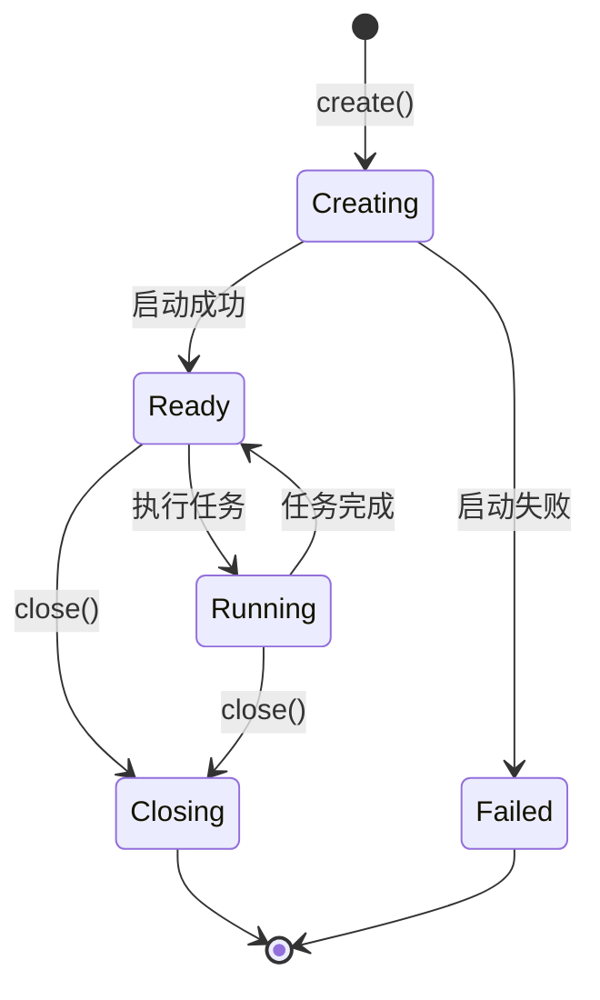

# E2B Sandbox 管理完整指南

## 概述

本文档详细介绍如何使用 E2B Python SDK 创建、管理和控制 Sandbox 实例，重点关注长期运行服务模式。

## 1. Sandbox 基础

### 1.1 Sandbox 生命周期



### 1.2 同步 vs 异步 API

E2B 提供两种 API 风格：

```python
# 同步 API（简单场景）
from e2b import Sandbox

sandbox = Sandbox(template="claude-agent-sandbox")
result = sandbox.run_code("python", "print('Hello')")
sandbox.close()

# 异步 API（推荐，性能更好）
from e2b import AsyncSandbox
import asyncio

async def main():
    sandbox = await AsyncSandbox.create(template="claude-agent-sandbox")
    result = await sandbox.run_code("python", "print('Hello')")
    await sandbox.close()

asyncio.run(main())
```

**推荐使用异步 API**，因为：
- 性能更好（非阻塞 I/O）
- 支持并发操作
- 适合长期运行服务

## 2. Sandbox 创建和配置

### 2.1 基本创建方式

```python
import asyncio
from e2b import AsyncSandbox

async def create_basic_sandbox():
    """创建基本的 Sandbox"""

    # 使用 Template ID
    sandbox = await AsyncSandbox.create(
        template="172m9tbyjat0ss16v9e8"
    )

    # 或使用 Template 别名（推荐）
    sandbox = await AsyncSandbox.create(
        template="claude-agent-sandbox"
    )

    return sandbox
```

### 2.2 完整配置选项

```python
import os
from e2b import AsyncSandbox

async def create_configured_sandbox():
    """创建完全配置的 Sandbox"""

    sandbox = await AsyncSandbox.create(
        # Template 配置
        template="claude-agent-sandbox",

        # 环境变量（运行时传递）
        env_vars={
            "ANTHROPIC_AUTH_TOKEN": os.getenv("ANTHROPIC_AUTH_TOKEN"),
            "CUSTOM_CONFIG": "value"
        },

        # 工作目录
        cwd="/home/user/workspace",

        # 超时设置（秒）
        timeout=3600,  # 1 小时

        # Metadata（用于标识和追踪）
        metadata={
            "user_id": "user_123",
            "task_type": "code_generation",
            "created_at": "2025-01-28"
        }
    )

    return sandbox
```

### 2.3 使用 Context Manager（推荐）

```python
from e2b import AsyncSandbox

async def safe_sandbox_operation():
    """使用 context manager 自动清理"""

    async with AsyncSandbox.create(template="claude-agent-sandbox") as sandbox:
        # Sandbox 会在代码块结束时自动关闭
        result = await sandbox.run_code("python", "print('Hello')")
        print(result.stdout)

    # 这里 Sandbox 已经自动关闭
```

## 3. Sandbox 核心 API

### 3.1 代码执行 - `run_code()`

在 Sandbox 中执行代码片段。

```python
# 基本用法
result = await sandbox.run_code(
    language="python",
    code="print('Hello, World!')"
)

print(result.stdout)  # "Hello, World!\n"
print(result.stderr)  # 错误输出（如果有）
print(result.exit_code)  # 0 表示成功

# 支持的语言
languages = [
    "python",      # Python 脚本
    "bash",        # Shell 命令
    "javascript",  # Node.js
    "typescript",  # TypeScript（需要 ts-node）
    "r",          # R 语言（需要安装）
]

# Bash 命令示例
result = await sandbox.run_code("bash", "ls -la /home/user/workspace")
print(result.stdout)

# 多行代码
python_code = """
import json
data = {"message": "Hello from Sandbox"}
print(json.dumps(data))
"""
result = await sandbox.run_code("python", python_code)
```

### 3.2 流式输出处理

```python
# 实时获取输出
result = await sandbox.run_code(
    "python",
    """
import time
for i in range(5):
    print(f"Step {i+1}")
    time.sleep(1)
""",
    on_stdout=lambda line: print(f"[STDOUT] {line}"),
    on_stderr=lambda line: print(f"[STDERR] {line}", file=sys.stderr)
)

# 输出:
# [STDOUT] Step 1
# [STDOUT] Step 2
# ...
```

### 3.3 进程管理 - `start_process()`

启动长期运行的进程（长期运行服务模式的关键）。

```python
# 启动后台进程
process = await sandbox.start_process(
    cmd="python /home/user/workspace/service.py",
    on_stdout=lambda line: print(f"[Service] {line}"),
    on_stderr=lambda line: print(f"[Error] {line}"),
    on_exit=lambda exit_code: print(f"[Exit] Code: {exit_code}")
)

# 进程 ID
print(f"Process ID: {process.pid}")

# 等待进程完成
exit_code = await process.wait()

# 或者发送信号
await process.send_signal("SIGINT")  # 中断信号
await process.kill()  # 强制终止
```

### 3.4 文件系统操作 - `files`

```python
# 写入文件
await sandbox.files.write(
    path="/home/user/workspace/config.json",
    content='{"key": "value"}'
)

# 读取文件
content = await sandbox.files.read("/home/user/workspace/config.json")
print(content)  # '{"key": "value"}'

# 列出文件
files = await sandbox.files.list("/home/user/workspace")
for file_info in files:
    print(f"{file_info.name} - {file_info.size} bytes")

# 删除文件
await sandbox.files.remove("/home/user/workspace/temp.txt")

# 创建目录
await sandbox.files.make_dir("/home/user/workspace/output")

# 检查文件是否存在
exists = await sandbox.files.exists("/home/user/workspace/config.json")

# 下载文件（读取为字节）
binary_data = await sandbox.files.read_bytes("/home/user/workspace/image.png")
with open("local_image.png", "wb") as f:
    f.write(binary_data)

# 上传文件
with open("local_file.txt", "rb") as f:
    await sandbox.files.write_bytes("/home/user/workspace/uploaded.txt", f.read())
```

### 3.5 端口和网络 - `get_hostname()`

```python
# 启动 Web 服务
await sandbox.run_code("bash", """
python -m http.server 8000 > /tmp/server.log 2>&1 &
""")

# 获取可访问的 URL
url = sandbox.get_hostname(port=8000)
print(f"Service URL: {url}")
# 输出: https://xxx.e2b.dev

# 从外部访问此 URL
import httpx
async with httpx.AsyncClient() as client:
    response = await client.get(url)
    print(response.text)
```

## 4. Sandbox 管理器实现

### 4.1 实际项目中的 Sandbox 管理器

```python
"""
sandbox_manager.py - Sandbox 生命周期管理器

提供 E2B Sandbox 的创建、管理和资源清理功能，支持异步 Context Manager 模式。
"""

from typing import Optional
from e2b import AsyncSandbox


class SandboxManager:
    """长期运行的 Sandbox 管理器

    支持异步 Context Manager 模式，自动管理 Sandbox 生命周期。

    示例:
        async with SandboxManager(template_id, envs) as manager:
            result = await manager.execute_code("python", "print('Hello')")

    Attributes:
        template_id: E2B Template ID
        envs: 环境变量字典
        sandbox: AsyncSandbox 实例（启动后可用）
    """

    def __init__(self, template_id: str, envs: Optional[dict] = None):
        """初始化 Sandbox 管理器

        Args:
            template_id: E2B Template ID（如 "or5xvfgibxlz5u6oa6p1"）
            envs: 可选的环境变量字典，覆盖 Template 默认值
        """
        self.template_id = template_id
        self.envs = envs or {}
        self.sandbox: Optional[AsyncSandbox] = None

    async def __aenter__(self):
        """Context Manager 入口：自动启动 Sandbox"""
        await self.start()
        return self

    async def __aexit__(self, exc_type, exc_val, exc_tb):
        """Context Manager 出口：自动关闭 Sandbox"""
        await self.close()

    async def start(self):
        """启动 Sandbox

        创建 AsyncSandbox 实例并初始化环境。

        Raises:
            Exception: Sandbox 创建失败时抛出
        """
        if self.sandbox is not None:
            print("⚠️ Sandbox 已经启动，跳过重复创建")
            return

        print(f"🚀 创建 Sandbox...")
        try:
            self.sandbox = await AsyncSandbox.create(
                template=self.template_id,
                envs=self.envs,
                timeout=3600  # 1小时超时
            )
            print(f"✅ Sandbox 已创建 (ID: {self.sandbox.sandbox_id})")
        except Exception as e:
            print(f"❌ Sandbox 创建失败: {e}")
            raise

    async def close(self):
        """关闭 Sandbox

        安全关闭 Sandbox 实例并释放所有资源。
        即使发生异常也会确保资源清理。
        """
        if self.sandbox is None:
            return

        try:
            await self.sandbox.kill()
            print("✅ Sandbox 已关闭")
        except Exception as e:
            print(f"⚠️ 关闭 Sandbox 时出错: {e}")
        finally:
            self.sandbox = None

    async def execute_code(self, language: str, code: str):
        """在 Sandbox 中执行代码

        Args:
            language: 代码语言（如 "python", "bash"）
            code: 要执行的代码字符串

        Returns:
            执行结果对象，包含 stdout, stderr, exit_code 属性

        Raises:
            RuntimeError: Sandbox 未启动时抛出

        示例:
            result = await manager.execute_code("python", "print('Hello')")
            print(result.stdout)  # "Hello\\n"
            print(result.exit_code)  # 0
        """
        if self.sandbox is None:
            raise RuntimeError("Sandbox 未启动，请先调用 start() 或使用 async with")

        # 根据语言构建执行命令
        if language.lower() == "python":
            # 使用 shlex.quote 避免 shell 转义问题
            import shlex
            cmd = f"python3 -c {shlex.quote(code)}"
        elif language.lower() == "bash":
            cmd = code
        else:
            # 其他语言直接当作 bash 命令执行
            cmd = f"{language} {code}"

        return await self.sandbox.commands.run(cmd, on_stdout=lambda data: print(data), on_stderr=lambda data: print(data))


# 使用示例
async def main():
    """使用 SandboxManager 的示例"""

    # 准备环境变量
    env_vars = {
        "ANTHROPIC_AUTH_TOKEN": os.getenv("ANTHROPIC_AUTH_TOKEN")
    }

    # 使用 context manager
    async with SandboxManager(
        template_id="claude-agent-sandbox",
        env_vars=env_vars,
        timeout=3600
    ) as manager:

        # 执行 Python 代码
        result = await manager.execute_python("""
import sys
print(f"Python version: {sys.version}")
""")
        print(result.stdout)

        # 执行 Bash 命令
        result = await manager.execute_bash("claude-code --version")
        print(result.stdout)


if __name__ == "__main__":
    asyncio.run(main())
```

### 4.2 增强版 Sandbox 管理器（带重试）

```python
"""
sandbox_manager_advanced.py - 增强版 Sandbox 管理器
"""

import asyncio
from typing import Optional, Callable
from e2b import AsyncSandbox
from tenacity import (
    retry,
    stop_after_attempt,
    wait_exponential,
    retry_if_exception_type
)


class AdvancedSandboxManager:
    """
    增强版 Sandbox 管理器

    新增特性:
    - 自动重试机制
    - 健康检查
    - 资源监控
    - 事件回调
    """

    def __init__(
        self,
        template_id: str,
        env_vars: Optional[dict] = None,
        timeout: int = 3600,
        max_retries: int = 3,
        on_create: Optional[Callable] = None,
        on_close: Optional[Callable] = None,
        on_error: Optional[Callable] = None
    ):
        self.template_id = template_id
        self.env_vars = env_vars or {}
        self.timeout = timeout
        self.max_retries = max_retries
        self.sandbox: Optional[AsyncSandbox] = None
        self._closed = False

        # 事件回调
        self.on_create = on_create
        self.on_close = on_close
        self.on_error = on_error

    @retry(
        stop=stop_after_attempt(3),
        wait=wait_exponential(multiplier=1, min=2, max=10),
        retry=retry_if_exception_type(ConnectionError)
    )
    async def start(self):
        """启动 Sandbox（带重试）"""
        if self.sandbox is not None:
            return

        print(f"🚀 正在创建 Sandbox (尝试 {self.max_retries} 次)...")

        try:
            self.sandbox = await AsyncSandbox.create(
                template=self.template_id,
                env_vars=self.env_vars,
                timeout=self.timeout
            )

            print(f"✅ Sandbox 创建成功 (ID: {self.sandbox.id})")
            self._closed = False

            # 触发创建回调
            if self.on_create:
                await self.on_create(self.sandbox)

            # 健康检查
            await self._health_check()

        except Exception as e:
            print(f"❌ Sandbox 创建失败: {e}")

            # 触发错误回调
            if self.on_error:
                await self.on_error(e)

            raise

    async def _health_check(self):
        """健康检查"""
        try:
            result = await self.sandbox.run_code("bash", "echo 'health_check'")
            if result.exit_code == 0 and "health_check" in result.stdout:
                print("✅ 健康检查通过")
            else:
                print("⚠️  健康检查异常")

        except Exception as e:
            print(f"⚠️  健康检查失败: {e}")

    async def close(self):
        """关闭 Sandbox"""
        if self.sandbox is None or self._closed:
            return

        print(f"🔄 正在关闭 Sandbox...")

        try:
            # 触发关闭回调
            if self.on_close:
                await self.on_close(self.sandbox)

            await self.sandbox.close()
            print("✅ Sandbox 已关闭")

        except Exception as e:
            print(f"⚠️  关闭失败: {e}")

        finally:
            self.sandbox = None
            self._closed = True

    async def execute_with_retry(
        self,
        language: str,
        code: str,
        max_attempts: int = 3
    ):
        """执行代码（带重试）"""
        if self.sandbox is None:
            raise RuntimeError("Sandbox 未启动")

        for attempt in range(max_attempts):
            try:
                result = await self.sandbox.run_code(language, code)

                if result.exit_code == 0:
                    return result
                else:
                    print(f"⚠️  执行失败 (尝试 {attempt + 1}/{max_attempts})")
                    if attempt < max_attempts - 1:
                        await asyncio.sleep(2 ** attempt)  # 指数退避

            except Exception as e:
                print(f"❌ 执行出错 (尝试 {attempt + 1}/{max_attempts}): {e}")
                if attempt < max_attempts - 1:
                    await asyncio.sleep(2 ** attempt)
                else:
                    raise

        raise RuntimeError(f"执行失败，已重试 {max_attempts} 次")

    async def __aenter__(self):
        await self.start()
        return self

    async def __aexit__(self, exc_type, exc_val, exc_tb):
        await self.close()


# 使用示例
async def main():
    """使用增强版管理器"""

    # 定义回调函数
    async def on_create_callback(sandbox):
        print(f"📦 Sandbox 创建回调: {sandbox.id}")

    async def on_close_callback(sandbox):
        print(f"📦 Sandbox 关闭回调: {sandbox.id}")

    async def on_error_callback(error):
        print(f"❌ 错误回调: {error}")

    # 使用管理器
    async with AdvancedSandboxManager(
        template_id="claude-agent-sandbox",
        env_vars={"KEY": "value"},
        on_create=on_create_callback,
        on_close=on_close_callback,
        on_error=on_error_callback
    ) as manager:

        # 执行代码（带重试）
        result = await manager.execute_with_retry(
            "python",
            "print('Hello, World!')",
            max_attempts=3
        )

        print(result.stdout)


if __name__ == "__main__":
    asyncio.run(main())
```

## 5. 长期运行服务模式

### 5.1 长期运行服务示例

```python
"""
long_running_service.py - 长期运行的 Sandbox 服务
"""

import asyncio
from sandbox_manager import SandboxManager


class LongRunningService:
    """长期运行的 Sandbox 服务"""

    def __init__(self, template_id: str):
        self.manager = SandboxManager(
            template_id=template_id,
            timeout=7200  # 2 小时
        )
        self.running = False

    async def start(self):
        """启动服务"""
        await self.manager.start()
        self.running = True
        print("✅ 服务已启动")

    async def stop(self):
        """停止服务"""
        self.running = False
        await self.manager.close()
        print("✅ 服务已停止")

    async def process_task(self, task: dict):
        """处理单个任务"""
        task_type = task.get("type")
        task_data = task.get("data")

        print(f"📝 处理任务: {task_type}")

        if task_type == "python":
            result = await self.manager.execute_python(task_data)
        elif task_type == "bash":
            result = await self.manager.execute_bash(task_data)
        else:
            print(f"⚠️  未知任务类型: {task_type}")
            return None

        return result

    async def run_forever(self, task_queue: asyncio.Queue):
        """持续运行，处理队列中的任务"""
        print("🔄 服务进入运行循环...")

        while self.running:
            try:
                # 从队列获取任务（带超时）
                task = await asyncio.wait_for(
                    task_queue.get(),
                    timeout=30.0
                )

                # 处理任务
                result = await self.process_task(task)

                if result:
                    print(f"✅ 任务完成: {result.stdout[:100]}")

                # 标记任务完成
                task_queue.task_done()

            except asyncio.TimeoutError:
                # 超时，继续等待
                continue

            except Exception as e:
                print(f"❌ 任务处理出错: {e}")

        print("🔄 服务退出运行循环")


# 使用示例
async def main():
    """长期运行服务示例"""

    # 创建任务队列
    task_queue = asyncio.Queue()

    # 创建服务
    service = LongRunningService(template_id="claude-agent-sandbox")

    try:
        # 启动服务
        await service.start()

        # 添加一些任务
        await task_queue.put({
            "type": "python",
            "data": "print('Task 1')"
        })

        await task_queue.put({
            "type": "bash",
            "data": "echo 'Task 2'"
        })

        await task_queue.put({
            "type": "python",
            "data": "import sys; print(sys.version)"
        })

        # 运行服务（在后台任务中）
        service_task = asyncio.create_task(
            service.run_forever(task_queue)
        )

        # 等待所有任务完成
        await task_queue.join()

        # 停止服务
        await service.stop()

        # 等待服务任务完成
        await service_task

    except KeyboardInterrupt:
        print("\n⚠️  收到中断信号")
        await service.stop()


if __name__ == "__main__":
    asyncio.run(main())
```

## 6. 并发和批处理

### 6.1 并发执行多个任务

```python
async def concurrent_tasks():
    """在同一个 Sandbox 中并发执行任务"""

    async with SandboxManager("claude-agent-sandbox") as manager:

        # 定义多个任务
        tasks = [
            manager.execute_python("print('Task 1')"),
            manager.execute_python("print('Task 2')"),
            manager.execute_bash("echo 'Task 3'"),
        ]

        # 并发执行
        results = await asyncio.gather(*tasks, return_exceptions=True)

        # 处理结果
        for i, result in enumerate(results):
            if isinstance(result, Exception):
                print(f"❌ Task {i+1} failed: {result}")
            else:
                print(f"✅ Task {i+1}: {result.stdout}")
```

### 6.2 多个 Sandbox 并行处理

```python
async def parallel_sandboxes():
    """创建多个 Sandbox 并行处理任务"""

    tasks_list = [
        "print('Sandbox 1')",
        "print('Sandbox 2')",
        "print('Sandbox 3')"
    ]

    async def process_in_sandbox(task_code):
        """在独立的 Sandbox 中处理任务"""
        async with SandboxManager("claude-agent-sandbox") as manager:
            result = await manager.execute_python(task_code)
            return result.stdout

    # 并行处理
    results = await asyncio.gather(*[
        process_in_sandbox(task) for task in tasks_list
    ])

    for i, output in enumerate(results):
        print(f"Sandbox {i+1} output: {output}")
```

## 7. 监控和日志

### 7.1 任务执行日志

```python
import logging
from datetime import datetime

# 配置日志
logging.basicConfig(
    level=logging.INFO,
    format='%(asctime)s - %(levelname)s - %(message)s'
)
logger = logging.getLogger(__name__)


async def execute_with_logging(manager, language, code):
    """带日志的任务执行"""

    start_time = datetime.now()
    logger.info(f"开始执行 {language} 代码")

    try:
        result = await manager.execute_code(language, code)

        duration = (datetime.now() - start_time).total_seconds()
        logger.info(f"执行完成 (耗时: {duration:.2f}s, 退出码: {result.exit_code})")

        if result.stdout:
            logger.info(f"输出: {result.stdout[:200]}")

        if result.stderr:
            logger.warning(f"错误输出: {result.stderr[:200]}")

        return result

    except Exception as e:
        duration = (datetime.now() - start_time).total_seconds()
        logger.error(f"执行失败 (耗时: {duration:.2f}s): {e}")
        raise
```

## 8. 总结

本章介绍了 E2B Sandbox 管理的完整方案，包括：

- ✅ Sandbox 生命周期管理
- ✅ 核心 API 的详细用法
- ✅ 基础和增强版 SandboxManager 实现
- ✅ 长期运行服务模式
- ✅ 并发和批处理模式
- ✅ 监控和日志最佳实践

下一章将介绍如何在 Sandbox 中集成 Claude Agent SDK。
